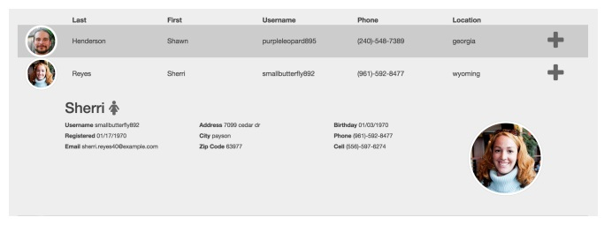
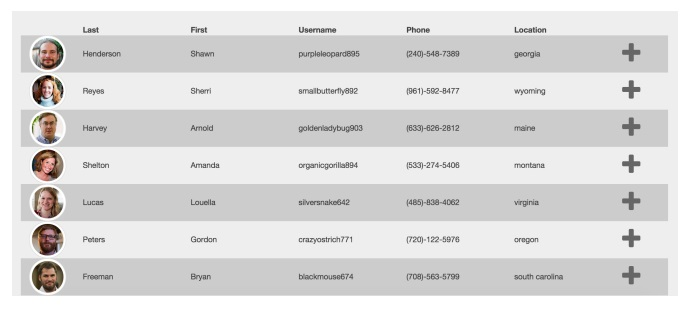
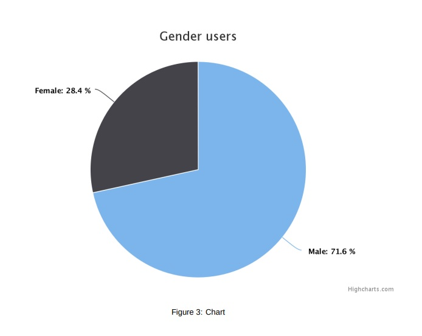

## Приложение "Список пользователей"

Задача: Разработать приложение-клиент(фронтенд) для REST сервиса.

На главной странице должен отображаться список пользователей как показано ниже.
Данные должны загружаться с помощью AJAX запроса с https://randomuser.me/ API.
При нажатии на любого пользователя из списка - должна отображаться более детальная информация о
пользователе в виде аккордеона. Иконка “+” должна меняться на “-” если открыта детальная информация.
Одновременно может быть открыт только один пользователь.

Требования:

1. User List / Список пользователей
* Отобразить User List c https://randomuser.me/ API который будет содержать:
  * Avatar image / Изображение пользователя
  * Last name / Фамилия
  * First name / Имя
  * Username / Никнейм
  * Phone / Телефон
  * Location / Адрес
* Аватар должен иметь круглую форму.

Figure 1: User List

* Строки в списке должны чередовать цвета.

2. User Details / Данные о пользователе
* Когда пользователь кликает на одного из юзеров, должна появляться дополнительная информация:
  * Last name / Фамилия
  * First Name / Имя
  * Gender icon / Пол
  * Username / Никнейм
  * Registered date / Дата регистрации
  * Email / Емаил
  * Location / Адрес
  * Birthday / Дата рождения
  * Phone / Телефон
  * Cell / Мобильный телефон
  * Bigger avatar image / Увеличенное изображение пользователя
* При повторном нажатии на выбранную строку она должны свернуться обратно.
* При выборе другой строки - предыдущая должна быть свернута.

3. Поиск На странице должно быть поле ввода для поиска. Поиск должен искать юзеров по полю
‘first_name’ (частичное вхождение)

4. Chart / График
В верху страницы должна находиться кнопка “Show chart” При нажатии на “Show chart” должен открываться
popup(модальное окно) в котором должен отобразиться график “Gender of users”.

Figure 2: User Detail

Figure 3: Chart
